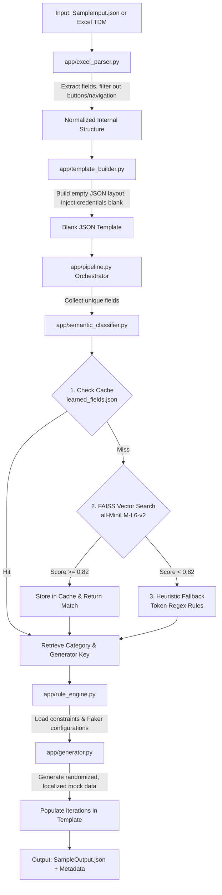

# AI Test Data Generator 🚀

AI Test Data Generator is a highly realistic synthetic test data engine designed for Test Data Management (TDM) and automation pipelines. It reads structured JSON templates or TDM Excel layouts, semantically classifies data fields using local AI models, and generates matching, privacy-compliant mock data in the exact structural shape required by your test scripts.

> [!NOTE]
> **Fully Local and Privacy-Compliant:** This system runs entirely on your local machine. It uses local SentenceTransformer embeddings and a FAISS vector search database, meaning **no external API calls** are made for data classification or generation.

---

## Table of Contents
- [Core Architecture & System Flow](#core-architecture--system-flow)
- [Key Features](#key-features)
- [Project Directory Structure](#project-directory-structure)
- [Environment Setup](#environment-setup)
- [How to Run](#how-to-run)
  - [1. Smoke Test (Verification)](#1-smoke-test-verification)
  - [2. Local CLI Execution](#2-local-cli-execution)
  - [3. Running the FastAPI Web Server](#3-running-the-fastapi-web-server)
- [API Endpoints Reference](#api-endpoints-reference)
- [Customization & Tuning](#customization--tuning)

---

## Core Architecture & System Flow

The application executes in a sequence of stages divided between **deterministic structural parsing** and **intelligent semantic generation**:



### Stage 1: Deterministic Structural Parsing (Zero AI)
- **Input Parsing (`app/excel_parser.py`):** Extracts test suites, Selenium execution flow objects, iteration counts, and fields. It strips out button clicks and navigation fields (`Type == 24` or `IsNavigation == true`) as they do not represent editable data.
- **Template Building (`app/template_builder.py`):** Constructs a blank template matching the target JSON structure. Login credential keys (like `url`, `userid`, `password`) are built but kept blank, as they represent environment-specific configurations.

### Stage 2: Intelligent Semantic Generation
- **Semantic Classification (`app/semantic_classifier.py`):** For each unique field name (e.g., `Patient Name`), the classifier discovers the appropriate generator using a 3-tier cascade:
  1. **Cache lookup (`learned_fields.json`):** Direct key check for previously resolved or manually corrected mappings.
  2. **FAISS similarity database:** Embeds the field name using a local `SentenceTransformer` (`all-MiniLM-L6-v2`) and finds the closest matching vector from our pre-defined knowledge base. If the similarity score meets the threshold (`0.82`), it maps to the matching category.
  3. **Heuristic token-matching:** If similarity is too low, regex rules scan words (e.g., matching `id` tokens to UUID, `salary` to wage).
- **Mock Generation (`app/generator.py`):** Applies validation constraints (from `app/rule_engine.py`) and utilizes `Faker` (configured for Indian English `en_IN` by default) or custom formatters to yield valid data (e.g., realistic phone numbers starting with 6-9, standard PAN/Aadhar formats, Indian PIN codes).
- **Template Population:** Fills each iteration with distinct generated values and writes the final structure.

---

## Key Features

- **Local SentenceTransformer + FAISS Engine:** Employs cosine similarity matching on dense embeddings to handle variations in developer field naming conventions (e.g. `Mobile`, `Mobile No`, `Phone`, `Contact` all resolve to a phone generator).
- **Feedback-Driven Learning Loop:** Corrections submitted via the API are persistently cached and inserted into the live FAISS index, ensuring the tool gets smarter with every user input.
- **Business Rule Constraints:** Integrates a rule engine (`app/rule_engine.py`) specifying ranges (e.g. age between 18 and 80) and formatting rules (e.g. `EMP#####` prefixes for employee IDs).
- **Excel & JSON Formats Supported:** Directly ingest `.json` schema exports or `.xlsx` TDM sheets to generate outputs.

---

## Project Directory Structure

```text
AI-TestData-Generator/
├── app/                            # Core application logic package
│   ├── api.py                      # FastAPI endpoint routes, handlers and request validation
│   ├── cache.py                    # Persistent JSON cache for classification results
│   ├── config.py                   # Centralized constants, paths, and thresholds
│   ├── embedding_engine.py         # SentenceTransformer wrapper for text vectorization
│   ├── excel_parser.py             # Parser for Excel (.xlsx) and JSON test configuration schemas
│   ├── faiss_store.py              # FAISS index wrapper for vector similarity matching
│   ├── generator.py                # Faker-backed and custom regex mock data generators
│   ├── models.py                   # Pydantic schemas for request/response bodies
│   ├── pipeline.py                 # Core orchestrator tying parsing, classification, and generation
│   ├── rule_engine.py              # Schema containing business rules, weights, and constraints
│   ├── semantic_classifier.py      # Tiered classifier (Cache -> FAISS Vector -> Heuristics)
│   └── template_builder.py         # Formats structured data into the empty JSON templates
│
├── knowledge_base/                 # Persistent AI matching knowledge
│   ├── faiss_index.bin             # Binary index of vectorized field names
│   ├── faiss_meta.json             # Labels mapped to vectors in the index
│   ├── field_mapping.json          # Curated static field-to-generator mappings
│   └── learned_fields.json         # JSON cache of dynamically learned classification mappings
│
├── SampleInput.json                # Reference input structure format
├── SampleOutput.json               # Reference populated output file format
├── TP_AppointmentList_TDM.xlsx    # Sample Excel Test Data Management template
├── start.py                        # Entry point to spin up the Web server
├── run_local.py                    # Command-line utility to run the pipeline on local files
├── test_smoke.py                   # Complete smoke test suite to validate all pipelines
├── deps.txt                        # Detailed environment dependencies
└── requirements_actual.txt         # Pinned python packages list for pip install
```

---

## Environment Setup

Ensure you have Python 3.10+ installed on your system.

### Fresh Clone Setup

If you just cloned the repository, follow these steps:

1. **Create a Python Virtual Environment:**
   *Windows PowerShell:*
   ```powershell
   python -m venv venv
   ```
   *Linux/macOS:*
   ```bash
   python3 -m venv venv
   ```

2. **Activate the Virtual Environment:**
   *Windows PowerShell:*
   ```powershell
   .\venv\Scripts\Activate.ps1
   ```
   *Linux/macOS:*
   ```bash
   source venv/bin/activate
   ```

3. **Install Dependencies:**
   ```bash
   pip install -r requirements_actual.txt
   ```

### Build the Executable (Optional)

To recreate the `dist/` and `build/` folders:
```bash
# Windows
.\deploy.bat
```

---

## Quick Start

Once setup is complete, you can immediately run:
```bash
# Run smoke tests to verify installation
python test_smoke.py

# Start the web server
python start.py
```

---

## How to Run

### 1. Smoke Test (Verification)
You can run the built-in smoke tests to verify config loading, model encoding, FAISS matching, rule extraction, and template builder assertions:
```bash
python test_smoke.py
```
If successful, you will see a detailed execution log ending in `ALL TESTS PASSED ✓`.

### 2. Local CLI Execution
You can run the pipeline directly over your local inputs using `run_local.py`.

```bash
# Generate data from SampleInput.json (writes to SampleOutput.json)
python run_local.py

# Generate data from a custom JSON file and write to a custom location
python run_local.py --input path/to/my_input.json --output path/to/my_output.json

# Generate data from the Excel template
python run_local.py --excel TP_AppointmentList_TDM.xlsx --output output/excel_output.json

# Supply classification hints and Faker configurations
python run_local.py --module Registration --locale en_IN --seed 42
```

### 3. Running the FastAPI Web Server
Start the development server to expose the Web API and UI:
```bash
python start.py
```
Once initialized, open your browser and navigate to:
- **Swagger Interactive Documentation UI:** [http://localhost:8000/docs](http://localhost:8000/docs)
- **ReDoc Alternate API View:** [http://localhost:8000/redoc](http://localhost:8000/redoc)

---

## API Endpoints Reference

| Endpoint | Method | Tags | Summary / Description |
| :--- | :--- | :--- | :--- |
| `/api/v1/generate` | `POST` | Data Generation | Accept a custom array of field definitions and generate N records. |
| `/api/v1/generate/from-json` | `POST` | Data Generation | Send a raw `SampleInput.json` structure to parse, classify, and generate a fully populated template. |
| `/api/v1/generate/from-excel` | `POST` | Data Generation | Upload a `.xlsx` TDM file to receive a fully populated template JSON. |
| `/api/v1/feedback` | `POST` | System / Cache | Correct a field's misclassification. Updates both persistent cache and FAISS index immediately. |
| `/api/v1/rebuild` | `POST` | System / Cache | Force-rebuild the FAISS index from the base `field_mapping.json` knowledge base. |
| `/api/v1/health` | `GET` | System | View status and stats (number of cached mappings, index size, loaded models). |
| `/api/v1/knowledge` | `GET` | System | Query all known field mappings across the static knowledge base and learned cache. |

### Sample Payloads

#### 1. POST `/api/v1/generate`
*Request:*
```json
{
  "module": "Payroll",
  "record_count": 2,
  "locale": "en_IN",
  "fields": [
    { "field_name": "Employee Name", "field_type": "String" },
    { "field_name": "Joining Date", "field_type": "Date" },
    { "field_name": "Basic Salary", "field_type": "Number" }
  ]
}
```

*Response:*
```json
{
  "module": "Payroll",
  "record_count": 2,
  "records": [
    {
      "Employee Name": "Pooja Deshpande",
      "Joining Date": "2023-11-14",
      "Basic Salary": 1450000
    },
    {
      "Employee Name": "Karan Malhotra",
      "Joining Date": "2021-04-02",
      "Basic Salary": 720000
    }
  ],
  "field_metadata": [
    {
      "field_name": "Employee Name",
      "category": "Full Name",
      "generator": "full_name",
      "confidence": 0.8872,
      "source": "faiss"
    },
    ...
  ],
  "warnings": []
}
```

#### 2. POST `/api/v1/feedback`
Use this endpoint to teach the model a new mapping or override a wrong classification:
*Request:*
```json
{
  "field_name": "patient_specialty_dept",
  "correct_category": "Department",
  "correct_generator": "department"
}
```

---

## Customization & Tuning

### How to add/modify static classifications:
1. Open `knowledge_base/field_mapping.json`.
2. Append your mappings under the `"fields"` array:
   ```json
   { "field_name": "Custom Target Field", "category": "Semantic Category", "generator": "generator_key" }
   ```
3. Rebuild the FAISS database index immediately by making a post call to `/api/v1/rebuild` or by restarting the application server.

### How to adjust thresholds:
Open `app/config.py` and modify `SIMILARITY_THRESHOLD`. The default is `0.82`. 
- **Higher Threshold (e.g., 0.90):** More conservative; falls back to heuristic patterns or generic strings if not an exact match.
- **Lower Threshold (e.g., 0.70):** More aggressive; maps fields to generators even with weaker semantic similarities.

### How to add new generator types:
1. Declare your new generator key and constraints in `RULES` inside [rule_engine.py](file:///c:/Users/mirasha%20charunethra/Downloads/AI-TestData-Generator/AI-TestData-Generator/app/rule_engine.py).
2. Write the corresponding mock value generation logic mapping to your generator key in [generator.py](file:///c:/Users/mirasha%20charunethra/Downloads/AI-TestData-Generator/AI-TestData-Generator/app/generator.py) (add it to the dispatch dictionary).
# AI-Assisted-test-data-management

# AI-Assisted-test-data-management

